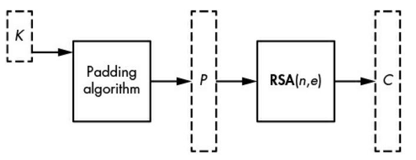
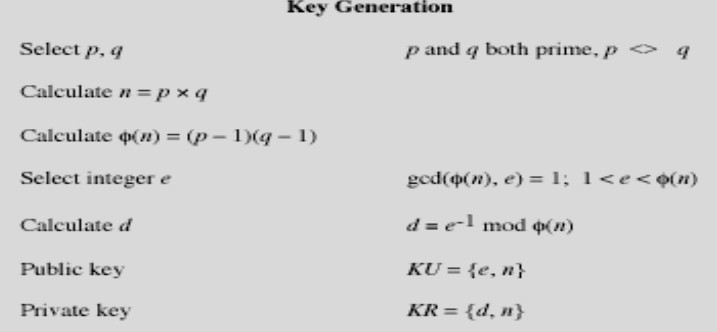

# TP Cryptography RSA-OAEP
## Definition
RSA-OAEP (Optimal Asymmetric Encryption Padding) is a standardized encryption scheme designed to enhance the security of RSA by addressing vulnerabilities such as malleability. Proposed by Mihir Bellare and Phillip Rogaway in 1995, it incorporates structured padding into the plaintext before encryption.



## Mechanism
### Key-pair generation


As stated in Cryptography's course, the key-pair generation will be as follows:
1. Select a large number of p and q that is half of the key size. It's to ensure the multiply of p and q will result in key size bits.

    * To generate a large number of prime, we use Miller-Rabin primality test to use because it's quick to determine primality of a large number
    * As stated [here](https://en.wikipedia.org/wiki/Miller%E2%80%93Rabin_primality_test), we can use random/secrets library to generate a strong probable prime using Miller-Rabin primality.

2. Calculate n = p * q
3. Calculate euler = φ(n) = (p - 1)(q - 1)
4. Select integer e that is coprime with φ(n). In default, use e = 65537, as mentioned in [here.](https://crypto.stackexchange.com/questions/3110/impacts-of-not-using-rsa-exponent-of-65537)
    * If e is not coprime with φ(n), keep adding 2 until its coprime.

5. Calculate d = e^-1 mod φ(n)
6. Return n, e, d for private-public key.
7. That function will be turned into hex numbers as its output in the GUI section.

## Execution in GUI

To run the program, execute the following command in your terminal or command prompt:

```
python GUI.py
```

### Key-pair Generation
1. Press "Generate Key Pair (2048-bit)" button
2. Enter the desired filenames for private and public keys
3. Select the location where you want to save the keys
4. Click "Generate Keys" button
5. Wait for the process to complete (this may take a moment)
6. The program will notify you when the keys have been generated successfully

### Encryption
1. Press "Browse" to select your public key file
2. Press "Browse" to select the file you want to encrypt
3. Click "Encrypt File" button
4. Choose a location and filename to save the encrypted file
5. Wait for the encryption process to complete
6. The program will notify you when the file has been encrypted successfully

### Decryption
1. Press "Browse" to select your private key file
2. Press "Browse" to select the encrypted file (.enc) you want to decrypt
3. Click "Decrypt File" button
4. Choose a location and filename to save the decrypted file
5. Wait for the decryption process to complete
6. The program will notify you when the file has been decrypted successfully

## Notes
- The implementation uses 2048-bit RSA keys
- SHA-256 is used as the hash function for OAEP padding
- The implementation is completely custom (no external cryptographic libraries)
- Any type of file can be encrypted/decrypted, but there are size limitations due to RSA constraints

## References
1. PKCS #1 v2.2: RSA Cryptography Specifications Version 2.2 (Section 7.1)
2. Miller-Rabin primality test: https://en.wikipedia.org/wiki/Miller%E2%80%93Rabin_primality_test
3. RSA Exponent Selection: https://crypto.stackexchange.com/questions/3110/impacts-of-not-using-rsa-exponent-of-65537
4. OAEP Padding: https://en.wikipedia.org/wiki/Optimal_asymmetric_encryption_padding
5. IETF RFC 8017: https://datatracker.ietf.org/doc/html/rfc8017#section-7.1

## Authors
1. Dafi Nafidz Radhiyya (2106701564)
2. Ivan Rabbani Cezeliano (2106701892)